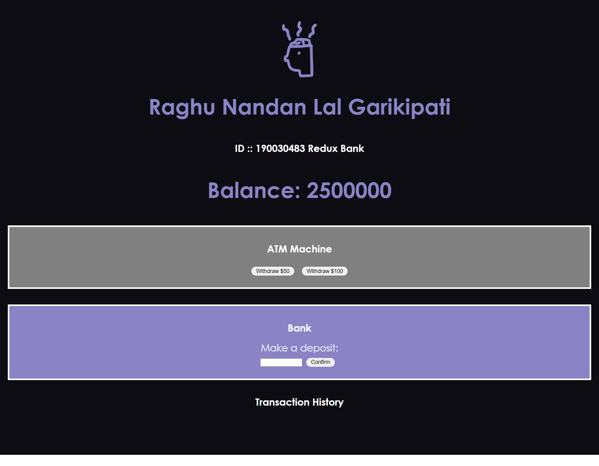

# Banking-app-using-React  
BankSystem is an open-source web project where users can create bank accounts, transfer money, create payment cards, pay with them or directly through their accounts, etc. It supports connecting multiple banks through the CentralApi. This allows money to be securely transferred between separate instances of BankSystem running on different machines. A banking system is a group or network of institutions that provide financial services for us. These institutions are responsible for operating a payment system, providing loans, taking deposits, and helping with investments.

A financial system is a set of institutions, such as banks, insurance companies, and stock exchanges, that permit the exchange of funds.Financial systems exist on firm, regional, and global levels. Borrowers, lenders, and investors exchange current funds to finance projects, either for consumption or productive investments, and to pursue a return on their financial assets. The financial system also includes sets of rules and practices that borrowers and lenders use to decide which projects get financed, who finances projects, and terms of financial deals.
 

Install Node Modules   
Check   npm --version  
        npm install --save  
        npm audit fix  
        npm start  

# Home Page (landing Page)

# Deposit 599$

# Withdrawl 100$

# Deposit 10000$

